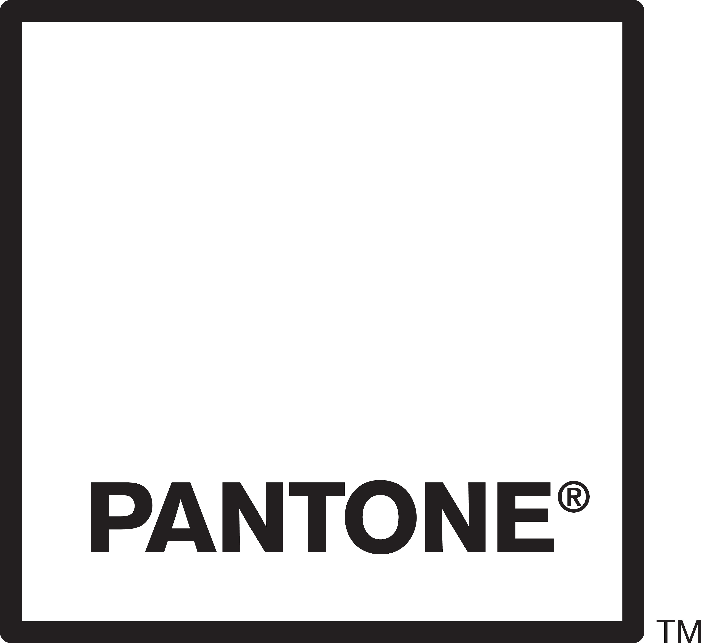

---
keywords:
  - Creative Cloud
  - API Documentation
  - JavaScript
  - CC Libraries API
  - Creative Cloud Libraries API
title: The Creative Cloud Developer Platform
description: Build plugins for Photoshop, InDesign, After Effects, Adobe XD and more. Integrate service APIs like Creative Cloud Libraries, Adobe Fonts, and Adobe Stock.
---

import {clouds, products} from '../products'

<!-- Hero -->
<Hero slots="image, heading, icon, text, buttons" variant="halfwidth" />

# Build for Creative Cloud

The Creative Cloud Developer Platform is a collection of APIs and SDKs that let you extend and integrate with Creative Cloud apps and services, which are used by millions of people around the world. From automating workflows to integrating your software with Creative Cloud, our developer platform has the tools you need to power creativity.

- [Browse our APIs](#api-list)
- [Visit the Developer Console](https://developer.adobe.com/console)

<!-- Newsletter -->
<AnnouncementBlock slots="heading, text, button" theme="dark" />

### Subscribe to the Creative Cloud Developer Newsletter

Be the first to hear about API launches, technology updates, marketplace news, developer events, and more by joining our newsletter.

[Sign up today](http://adobe.ly/devnews)

<!-- Extend, Integrate, Distribute -->
<TitleBlock slots="heading, text" theme="lightest" />

# Extend. Integrate. Distribute.

All on the Creative Cloud Developer Platform.

<TextBlock slots="image, heading, text1, links" />

## Extend Adobe Creative Cloud apps

Creative Cloud desktop apps offer APIs and SDKs that let you take them to new heights. Automate workflows, build new features, and connect Creative Cloud to other software and services. Write plugins or scripts, with or without UI, that tailor our industry-leading creative apps to individuals’ unique creative needs. [Browse the full list.](#api-list)

[Express](../express) &nbsp; &nbsp;
[Photoshop](../photoshop) &nbsp; &nbsp;
[InDesign](../indesign/uxp)  &nbsp;

<TextBlock slots="image, heading, text1, links" />

## Distribute to millions of users worldwide

Publish your plugins and integrations directly to the Marketplace in the Creative Cloud Desktop app for users to easily discover, install, and manage—and to the Enterprise Admin Console for admins to easily find, deploy, and give access to plugins and integrations intended for business use.

- [Creative Cloud Plugin Marketplace](https://exchange.adobe.com/creativecloud.html?route=discoverIntegrations&workflow=share)

<!-- Fund content -->
<TitleBlock slots="heading, text" theme="light" />

# The Adobe Fund for Design

Get funding to build Adobe Express add-ons — plugins and integrations that unleash the creativity of millions of users.

<ResourceCard slots="link, image, heading, text" width="50%" theme="light" />

[Adobe Fund for Design](https://developer.adobe.com/fund-for-design)

### The Adobe Fund for Design

Apply for a grant or investment.

<ResourceCard slots="link, image, heading, text" width="50%" theme="light" />

[Adobe Tech Blog | Get Funding to Build Adobe Express Add-Ons](https://blog.developer.adobe.com/get-funding-to-build-adobe-express-add-ons-093ddf8336be?source=friends_link&sk=f04b558801adc66ec89f25d8589e400b)

### Adobe Tech Blog

Get Funding to Build Adobe Express Add-Ons

<TitleBlock slots="heading, text" theme="dark" />

# The Creative Cloud Developer Community

Multiple focuses. Many identities. A singular mission to empower creativity.

<TextBlock slots="image, heading, text" width="33%" theme="dark" isCentered />

### Multiple focuses

Creative Cloud developers can build plugins and scripts for a single Creative Cloud app, or multiple apps at once. Or they can integrate services from Adobe into their own products. Some developers do all of these things!

<TextBlock slots="image, heading, text" width="33%" theme="dark" isCentered />

### Many identities

Creative Cloud developers may identify as _developer_, _scripter_, _entrepreneur_, _business owner_, and yes: _creative_ or _artist_. Some have worked with Adobe APIs for many years; others are learning their first JavaScript today.

<TextBlock slots="image, heading, text" width="33%" theme="dark" isCentered />

### A singular mission

No matter why or how they got here, Creative Cloud developers are on a mission to inspire and empower creatives to get more done in less time, collaborate in new ways, and push the boundaries of creativity.

<AnnouncementBlock slots="heading, text, button" theme="dark" />

## Connect with our community

We're rolling out a new set of forums for developers. We have categories for a selection of APIs to start, with support for more on the way.

[Join the Creative Cloud Developer Forums](https://forums.creativeclouddeveloper.com)

<!-- Partners -->

<TitleBlock slots="heading, text" theme="lightest" />

# Be in great company

[Explore the thousands of plugins and integrations designed for Creative Cloud.](https://www.adobe.com/creativecloud/extensibility.html)

<!-- 1 -->
<TextBlock slots="image" width="20%" theme="lightest" isCentered />

<TextBlock slots="image" width="20%" theme="lightest" isCentered />

<TextBlock slots="image" width="20%" theme="lightest" isCentered />

<TextBlock slots="image" width="20%" theme="lightest" isCentered />

<TextBlock slots="image" width="20%" theme="lightest" isCentered />

 

<!-- 2 -->
<TextBlock slots="image" width="20%" theme="lightest" isCentered />

<TextBlock slots="image" width="20%" theme="lightest" isCentered />

<TextBlock slots="image" width="20%" theme="lightest" isCentered />

<TextBlock slots="image" width="20%" theme="lightest" isCentered />

<TextBlock slots="image" width="20%" theme="lightest" isCentered />

<!-- Product cards -->

<TitleBlock slots="heading, text" theme="lightest" />

# Extensible Creative Cloud products and services

Many Creative Cloud apps and services are extensible through APIs, SDKs, and Events. Choose your favorite to get started.

<OldProductCardGrid clouds={clouds} products={products} filterByIds={[4, 6, 8, 5, 42, 3, 9, 7, 10, 11, 12, 13, 14, 15, 44]} />

<!-- Summary block -->
<SummaryBlock slots="image, heading, text, buttons" background="rgb(9, 90, 186)" />

## Get the latest news for Creative Cloud Developers

With the Creative Cloud Developer Newsletter and the Adobe Tech Blog, we offer regular content for anyone who creates plugins and integrations for the Creative Cloud family of products and services. Get updates in your inbox, in your RSS reader, or both!

- [Join the newsletter](http://adobe.ly/devnews)
- [Follow the blog](https://medium.com/adobetech)
